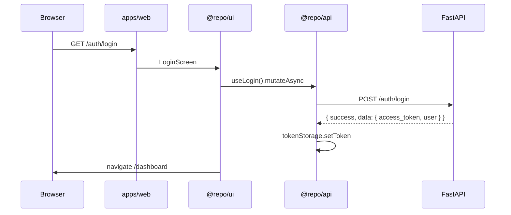

# Data flow

## Login → dashboard

## Quotation list (TanStack Query)

1. `useQuotations()` in `@repo/api` calls `GET /quotations`.
2. Response mapped via `mapQuotation()` to camelCase domain types.
3. Cached under `queryKeys.quotations.list()`.
4. Mutations invalidate list + detail keys on success.

## AI draft flow

1. User pastes brief on **Quotation create** (AI mode).
2. `POST /quotations/ai-draft` with `{ request, locale }`.
3. Backend `AiUsageService.enforce()` checks rate limits.
4. If `AI_API_KEY` set → provider call; else → offline heuristic.
5. Response validated as `AiDraftResponse`; logged to `ai_logs`.
6. User reviews items → creates quotation with `POST /quotations`.

## Approve → n8n → email

1. `POST /quotations/{id}/approve` sets status `Approved`.
2. `N8nService` POSTs webhook payload to `N8N_WEBHOOK_URL`.
3. n8n workflow sends email via Mailpit SMTP (dev).
4. Response includes `webhook_delivered` + `webhook_detail`.

## PDF export

1. **Preview** route renders `QuotationDocument` (shared layout).
2. **Export** uses `html2canvas` + `jspdf` on the same DOM - WYSIWYG with preview.
